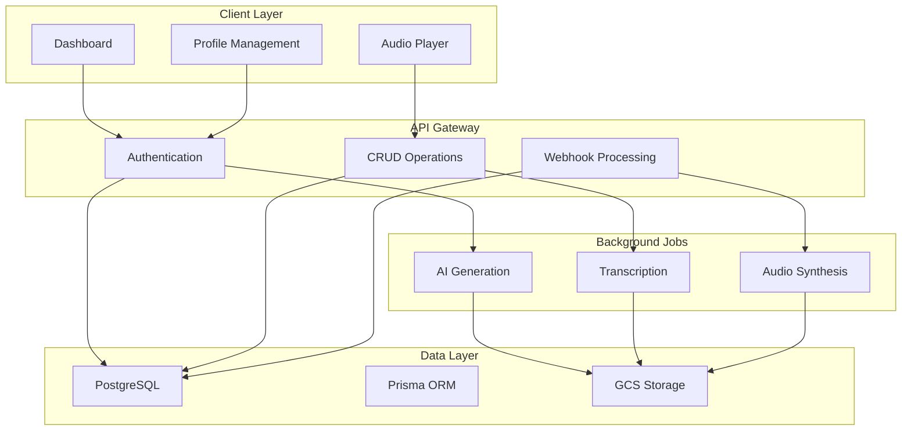

# PODSLICE.ai

PODSLICE is an AI-powered content curation platform that transforms long-form audio and video content into concise, personalized podcast summaries. Our core value proposition: "Cut the Chatter, Keep the Insight."

## Overview

The PODSLICE platform addresses information overload through a multi-tier SaaS subscription model (Free Slice, Casual Listener, Curate Control) with hierarchical feature access. Built on a modern server-first architecture using Next.js App Router, Inngest for background jobs, Prisma with PostgreSQL, Google Cloud Storage, and Clerk for authentication.

## Tech Stack

<p align="left">
  
  
  
  
  
  
  
  
</p>

### Core Technologies

- **Next.js 15** - Server Components for AI integration, App Router for scaling
- **PostgreSQL + Prisma** - ACID compliance for billing, type-safe ORM
- **Clerk** - Authentication with SOC 2/GDPR compliance
- **Google AI Suite** - Gemini for summarization and TTS
- **Inngest** - Background job orchestration with retry logic
- **Paddle** - Global payment processing and subscription management

## Getting Started

### Prerequisites

- Node.js (v20 or later)
- PostgreSQL database
- Clerk, Resend, Inngest, and Google Cloud API keys

### Installation

1. **Clone and install dependencies:**
```bash
git clone <your-repository-url>
cd ai-curated-podcast-app
npm install
npm install prisma --save-dev
```

2. **Set up environment variables:**
Create `.env.local` with:
- `DATABASE_URL` (pooler-ready, port 6543 for Supabase)
- `DIRECT_URL` (direct connection, port 5432 for Supabase)
- Clerk, Resend, Inngest, and Google Cloud credentials

3. **Initialize database:**
```bash
pnpm prisma:push
```

4. **Start development server:**
```bash
pnpm dev
```

Visit [http://localhost:3000](http://localhost:3000) to see the application.

## Architecture

### System Overview



### Key Systems

#### 1. Authentication & Authorization
- **Hybrid approach**: Clerk for identity + local user sync
- **Hierarchical access**: Plan-based feature gates
- **Benefits**: Vendor independence, performance, compliance

#### 2. Content Pipeline
- **Stage 1**: YouTube/RSS → Gemini Video Understanding (direct transcription – server-side caption scraping removed)
- **Stage 2**: Gemini summarization → Script generation → TTS (Gemini TTS)
- **Stage 3**: GCS storage → CDN → Audio player

> Note: All legacy YouTube caption scraping (ytdl / innertube / HTML) has been removed. Transcripts are produced exclusively via Gemini video models. The YouTube Data API is used only for safe metadata (title + duration). No other retrieval methods are active.

#### 3. Billing System
- **Event-driven**: Paddle webhooks for subscription management
- **Real-time validation**: Plan gates integrated with content delivery
- **Robust handling**: Retry logic, data consistency, graceful degradation

## Strategic Benefits

- **Scalability**: Server Components + background processing
- **Type Safety**: End-to-end TypeScript with Prisma
- **Business Alignment**: Technical architecture supports revenue model
- **Performance**: ISR caching and optimized data flow

