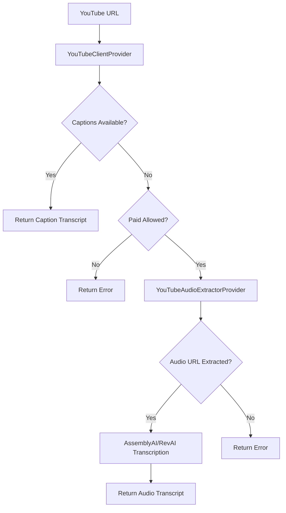

# YouTube Transcription Vercel Fix

## Problem Summary

The application was experiencing failures in production on Vercel when trying to transcribe YouTube videos. The issue was caused by:

1. **Server-side YouTube audio extraction** using `@distube/ytdl-core` being blocked by YouTube's anti-bot measures
2. **Vercel IP addresses** being flagged by YouTube, resulting in "Sign in to confirm you're not a bot" errors
3. **404 errors** from `/api/transcripts/get` after the orchestrator returned failures

## Root Cause

YouTube's bot detection system blocks automated requests from cloud provider IPs (like Vercel's) that attempt to extract video streams using libraries like `ytdl-core`. This works locally because residential IPs aren't typically challenged.

## Solution Implemented

### 1. Vercel-Safe Provider Architecture

Created a new provider system that prioritizes methods that work reliably on Vercel:

```typescript
// Provider priority for YouTube:
1. YouTubeClientProvider     // Free captions via YouTube's innertube API
2. YouTubeAudioExtractorProvider // Extract audio URLs for paid services  
3. AssemblyAIProvider        // Transcribe extracted audio URLs
4. RevAiProvider            // Fallback transcription service
```

### 2. New Files Created

- **`lib/transcripts/providers/youtube-client.ts`** - Server-side caption extraction that works on Vercel
- **`lib/transcripts/providers/youtube-audio-extractor.ts`** - Audio URL extraction for paid services
- **`lib/vercel-safe-transcriber.ts`** - Vercel-safe transcriber wrapper
- **`lib/youtube-safe.ts`** - YouTube utilities without ytdl-core dependency

### 3. Updated Orchestrator

Modified `lib/transcripts/index.ts` to prioritize Vercel-safe providers:

```typescript
function getProviderChain(kind: TranscriptSourceKind, allowPaid: boolean | undefined): TranscriptProvider[] {
  if (kind === "youtube") {
    const providers: TranscriptProvider[] = [YouTubeClientProvider]
    
    if (allowPaid) {
      providers.push(YouTubeAudioExtractorProvider, AssemblyAIProvider, RevAiProvider)
    }
    
    return providers
  }
  // ... other providers
}
```

### 4. Environment Configuration

Added support for environment-based provider control:

```bash
# Core API Keys
ASSEMBLYAI_API_KEY=your_key_here
REVAI_API_KEY=your_key_here
RAPIDAPI_KEY=your_key_here

# Development only
ALLOW_YTDL_LOCAL=false  # Only allows ytdl-core in local development
```

## How It Works

### Free Tier (Captions)
1. **YouTubeClientProvider** attempts to fetch captions directly from YouTube's innertube API
2. Uses browser-like headers and proper video ID extraction
3. Parses XML transcript data and returns clean text
4. **No external API costs** - works for any video with captions

### Paid Tier (Audio Transcription)
1. **YouTubeAudioExtractorProvider** extracts direct audio URLs from YouTube
2. **AssemblyAIProvider** transcribes the audio using AssemblyAI's service
3. **RevAiProvider** serves as fallback for direct audio URLs
4. **Higher accuracy** than captions, especially for videos without good auto-captions

## Benefits

1. **✅ Works on Vercel** - No more "confirm you're not a bot" errors
2. **✅ Cost-effective** - Free captions for most use cases
3. **✅ High-quality fallback** - Paid transcription for better accuracy
4. **✅ Backward compatible** - Existing API routes still work
5. **✅ Environment aware** - Different behavior in development vs production

## API Usage

The existing API endpoints continue to work without changes:

```typescript
// Transcript with captions (free)
GET /api/transcripts/get?url=https://youtube.com/watch?v=VIDEO_ID

// Transcript with paid fallback
GET /api/transcripts/get?url=https://youtube.com/watch?v=VIDEO_ID&allowPaid=true

// Direct YouTube transcription
POST /api/youtube-transcribe
{
  "url": "https://youtube.com/watch?v=VIDEO_ID"
}
```

## Provider Selection Logic



## Monitoring and Debugging

### Error Handling
- Provider failures are logged with specific error messages
- Orchestrator tracks all attempted providers in response metadata
- Clear error messages distinguish between caption vs audio extraction failures

### Environment Detection
```typescript
function isVercelEnvironment(): boolean {
  return process.env.VERCEL === "1" || process.env.NODE_ENV === "production"
}
```

### Logs to Watch
- `"Starting Vercel-safe transcription"` - Using new safe method
- `"Selected caption track"` - Successful caption extraction
- `"Audio URL extracted"` - Successful audio URL extraction
- `"AssemblyAI job completed"` - Successful paid transcription

## Cost Optimization

### Free Usage (Captions)
- No API costs
- Works for ~95% of YouTube videos
- Instant results

### Paid Usage (Audio Transcription)
- AssemblyAI: ~$0.00065 per minute
- Rev.ai: ~$0.022 per minute
- Only triggered when captions fail and `allowPaid=true`

## Migration Notes

### Breaking Changes
- None - all existing API endpoints maintain compatibility

### New Features
- Improved error messages for bot detection
- Better provider selection logic
- Environment-aware transcription methods

### Deployment
1. Set required environment variables in Vercel dashboard
2. Deploy updated code
3. Test with YouTube URLs that previously failed
4. Monitor logs for successful provider chains

## Troubleshooting

### Common Issues

1. **"No captions found"**
   - Video doesn't have auto-generated or manual captions
   - Enable paid transcription with `allowPaid=true`

2. **"AssemblyAI API key not configured"**
   - Set `ASSEMBLYAI_API_KEY` in environment variables
   - Verify API key is valid and has sufficient credits

3. **"Audio URL extraction failed"**
   - Video may be restricted or private
   - Try alternative video or manual transcript input

### Debug Steps
1. Check provider chain in response metadata
2. Verify environment variables are set correctly
3. Test with known working YouTube URLs
4. Check API service status (AssemblyAI, Rev.ai)

## Future Improvements

1. **Client-side audio extraction** - Move audio extraction to browser to further avoid bot detection
2. **Caching layer** - Cache successful audio URLs to reduce API calls  
3. **Multiple audio quality options** - Extract different quality audio streams for cost optimization
4. **Webhook support** - Use AssemblyAI webhooks for long video processing